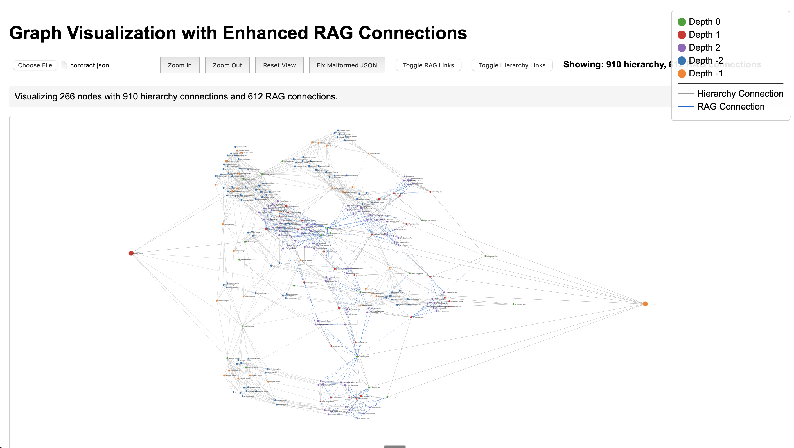

# GAKUDAN: Hierarchical Multi-Agent RAG System



## What This Does

GAKUDAN takes a complex question and automatically spawns a network of specialized AI agents to explore it from every angle. Each agent has a unique personality and perspective, they share knowledge through RAG connections, and their insights are hierarchically synthesized into comprehensive answers.

## How We Built It

### The Expansion Algorithm

The system starts with a single prompt and explodes it into a massive exploration graph:

1. **Meta-Prompting for Dynamic Personalities**: Instead of hardcoded agent types, we generate custom system prompts on-the-fly. The LLM analyzes the query and decides what types of experts would be most valuable - urban planners for city questions, biochemists for drug discovery, etc.

2. **Recursive Depth Exploration**: Each agent can spawn sub-agents if they determine their response needs deeper investigation. This creates a tree structure that can go multiple levels deep, with each level adding more specificity.

3. **Cross-Pollination Through RAG**: As agents generate responses, they're immediately indexed into a vector database. Other agents can retrieve relevant insights from their peers, creating a web of knowledge connections separate from the hierarchical structure.

### The RAG Implementation

Our RAG system is relationship-aware to prevent information loops:

- **Sibling Exclusion**: Agents don't retrieve information from their siblings (same parent)
- **Parent Exclusion**: Agents don't retrieve from their parent node
- **Similarity Tracking**: Every RAG connection stores its cosine similarity score
- **Dual-Edge Graph**: Hierarchy edges and RAG edges are tracked separately in a MultiDiGraph

### Thread Orchestration

The concurrent processing model enables massive parallelism:

```python
# Simplified view of our worker pool pattern
task_queue = Queue()
active_threads = 0
max_workers = min(10, num_prompts * 2)

# Workers pull from queue until exhausted
while not all_tasks_completed:
    task = task_queue.get()
    result = process_sub_prompt(task)
    if needs_deeper_exploration(result):
        spawn_child_tasks(task_queue)
```

### The Synthesis Engine

Contraction happens bottom-up through the graph:

1. **Leaf Processing**: Start with nodes that have no children
2. **Synthesis Node Creation**: For each original node, create a synthesis node that aggregates its children
3. **Hierarchical Aggregation**: Synthesis nodes at depth N feed into synthesis nodes at depth N-1
4. **Context Preservation**: The system explicitly maintains tone, specifics, and emotional content

## Technical Details Worth Noting

### Self-Modifying Behavior

The system rewrites its own instructions based on the query. When asked about "sustainable urban farming," it generates prompts that emphasize practical implementation. When asked about "theoretical physics," it emphasizes mathematical rigor. This happens through three meta-prompts:

- `THOUGHT_GENERATOR_SYSTEM_PROMPT`: Modified to recruit the right types of thinkers
- `SUB_PROMPT_SYSTEM_INSTRUCTION`: Adjusted to guide response style
- `COMBINER_SYSTEM_PROMPT`: Tuned for the specific synthesis needs

### Graph Complexity Management

With 266 nodes and 1,522 total connections (910 hierarchical, 612 RAG), the system handles:

- **Cycle Prevention**: DAG enforcement in hierarchy, but allowing cycles in RAG connections
- **Depth Balancing**: Automatic depth correction when edges create inconsistencies
- **Connection Pruning**: Invalid edges are detected and removed during graph cleaning

### Atomic Operations & Fault Tolerance

Every graph save is atomic:

```python
# Write to temp file
temp_file = f"{target}.tmp"
write_data(temp_file)

# Atomic rename
os.replace(temp_file, target)

# Backup management
if exists(target):
    os.rename(target, f"{target}.bak")
```

### Incremental Progress Tracking

The system dumps JSON after every sub-prompt completion, enabling:
- Real-time visualization of graph growth
- Recovery from crashes mid-exploration
- Client-side differential updates

## Architecture Decisions

### Why MultiDiGraph?

We need multiple edge types between the same nodes - a hierarchical parent-child relationship AND potentially multiple RAG connections with different similarity scores.

### Why Bottom-Up Synthesis?

Top-down would require knowing all children before processing. Bottom-up lets us process as soon as children are complete, enabling parallelism.

### Why Personality-Driven Agents?

Generic agents give generic answers. By assigning specific expert personas, we get domain-specific insights that wouldn't emerge from a single model.

## Next Evolution

### 1. **Tool-Augmented Agents**
Give agents ability to execute code, run searches, query databases. Each personality would have appropriate tools.

### 2. **Negotiation Protocols**
When agents disagree, implement structured debate where they present evidence and counter-arguments.

### 3. **Emergent Team Formation**
Remove the hierarchical constraint. Let agents form working groups based on expertise overlap and query requirements.

The system demonstrates that complex reasoning can emerge from simple rules: decompose, explore, retrieve, synthesize. The intelligence isn't in any single component but in their orchestration.